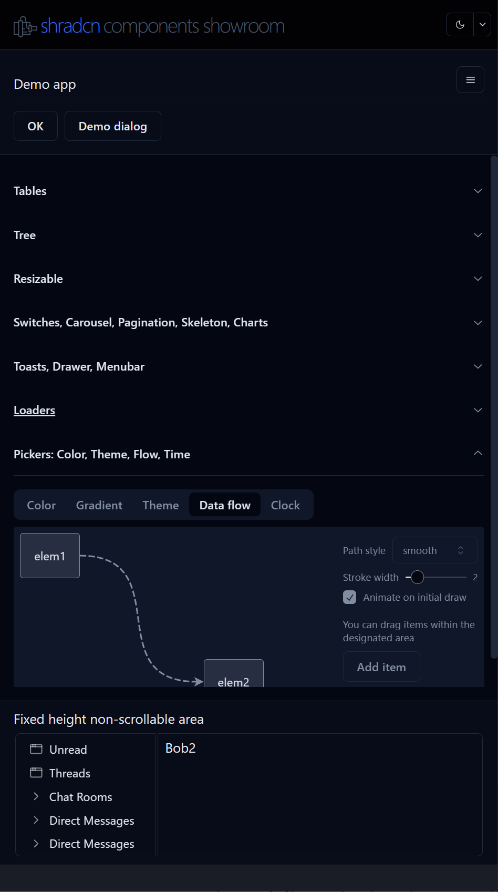

# About

***shadcn-tv** is a clone of shadcn manually installed components.*

The main difference is that component styles are formatted to make customization easier.
For example, instead of having a long line with many Tailwind classes, it is much easier to make changes if they are on separate lines.
In addition, the classes are also grouped according to their meaning.
First comes everything related to the position and size of the component, then color styles, state classes, and then classes related to child elements.

This is a template project. You can copy everything you need for your project from this project and install the appropriate dependency (mostly from the radix-ui library).

All formatted shardcn components are located in the ```src/comComponents/ui/shadcn``` folder.

# Installation

* add twMerge
* add tailwind-plugin-shadcn.ts
  


### Changes
 * removed "@jlns/hooks" from [jln13x](https://github.com/jln13x) for "embla-carousel"
 * removed "@jlns/zod" from [jln13x](https://github.com/jln13x) for "embla-carousel"
 * removed "usehooks-ts" used by "@jlns/hooks"
